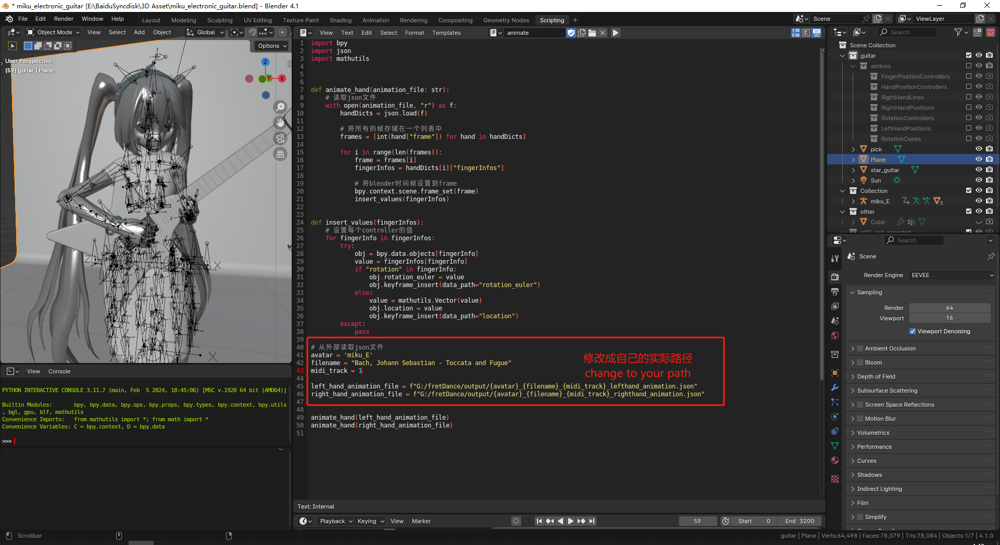

## FretDance (Rust Rewrite)



[中文说明点击这里](readmeCN.md)

**Note: This is a Rust rewrite of the original FretDance project. Original project: [https://github.com/highmore9501/fretDance](https://github.com/highmore9501/fretDance)**

Electric Guitar Performance Video:
[Furina - Maiden's Capriccio](https://youtu.be/8zbeerTxgmM)

Classical Guitar Performance Video:
[Jeht - Bird's Poem](https://youtu.be/Vt03JIjESB0)
[Ayaka Performs "Heron's Oath" on Guitar](https://youtu.be/3SDCxXPheTM)

For detailed tutorials and documentation, please visit my Zhihu Column (知乎专栏): [fretDance Column](https://www.zhihu.com/column/c_1932748054936684153)

Tutorial in BiliBili: [FretDance Video Tutorial](https://www.bilibili.com/video/BV1jYp8zQEh2/?spm_id_from=333.1387.0.0)

### Note to English Readers:

Due to the extensive documentation content, I recommend viewing my Zhihu Column for complete information.

As the author is not a native English speaker, this README may contain machine-translated text. For better understanding, I suggest English readers:

1. Visit my Zhihu Column
2. Use browser translation plugins for optimal reading experience

The automatic translation from Chinese to English typically provides more accurate results than my direct machine translation here.

### About This Rewrite

This version is a complete rewrite of the original FretDance project in Rust, aiming to improve performance, maintainability, and stability while retaining all the original functionality.

```

```
